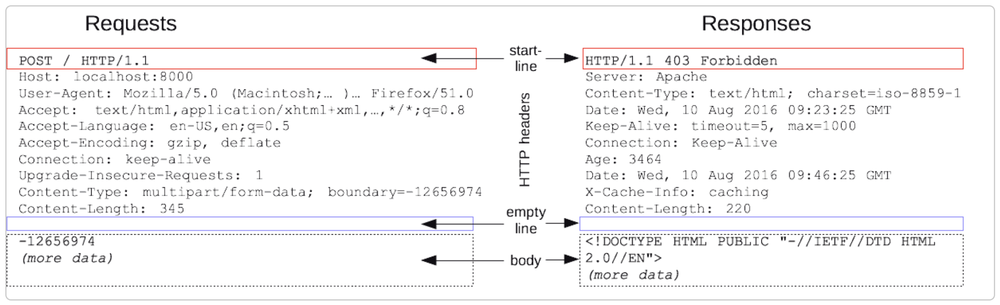

# [HTTP message](https://developer.mozilla.org/ko/docs/Web/HTTP/Messages)

HTTP 메시지는 서버와 클라이언트 간에 데이터가 교환되는 방식.

- [HTTP message](#http-message)
  - [타입](#타입)
  - [개요](#개요)
    - [왜 사용함?](#왜-사용함)
  - [HTTP request](#http-request)
    - [start line](#start-line)
    - [HTTP headers](#http-headers)
    - [Body](#body)
  - [HTTP response](#http-response)
    - [status line](#status-line)
    - [HTTP header](#http-header)
    - [Body](#body-1)

## 타입

1. request (요청)
   - 클라이언트가 서버로 전달해서 서버의 액션이 일어나게끔 하는 메시지
2. response (응답)
   - 요청에 대한 서버의 답변

## 개요

HTTP 메시지는 ASCII로 인코딩된 텍스트 정보, 여러 줄로 이루어져 있음.

HTTP 메시지를 텍스트로 작성하는 경우는 드뭄. 이제는 소프트웨어, 브라우저, 프록시, 웹 서버가 그 일을 대신함.  
설정 파일(프록시 혹은 서버의 경우), API(브라우저의 경우), 혹은 다른 인터페이스를 통해 메시지가 제공됨.  

### 왜 사용함?

서버와 클라이언트 간에 데이터가 어떻게 교환되었는지 볼 수 있음.



```md
POST / HTTP/1.1         <- start line: 실행되야 할 요청 / 요청 수행 성공 여부가 기록됨. 항상 한 줄.
Host: localhost:8000
...                     <- HTTP headers: 옵션. 요청 / 메시지 본문에 대한 설명
                        <- empty line: 요청에 대한 모든 메타 정보가 전송되었음을 알려주는 빈줄
(more data)             <- body: 요청과 관련된 내용 / 응답과 관련된 문서. body의 존재 유무와 크기는 첫 줄과 HTTP 헤더에 명시되어 있음.
```

## HTTP request

### start line

HTTP request는 서버가 특정 동작을 취할 수 있도록 클라이언트에서 전송하는 메시지. 다음 세 가지 요소로 이루어져 있음.

1. [HTTP Method](https://developer.mozilla.org/ko/docs/Web/HTTP/Methods)

   - GET, PUT, POST, HEAD, OPTIONS 등을 사용해 서버가 해야할 일을 명시.

2. 상태 코드

   - 주로 URL, 프로토콜, 포트, 도메인의 절대 경로로 나타낼 수도 있음. 이들은 요청 컨텍스트에 의해 특정지어짐. 요청 타겟 포맷은 HTTP 메소드에 따라 달라짐.
     - origin 형식 : 끝에 `?`와 쿼리 문자열이 붙는 절대 경로. 예: `POST / HTTP 1.1 GET /background.png HTTP/1.0 HEAD /test.html?query=alibaba HTTP/1.1 OPTIONS /anypage.html HTTP/1.0`
     - absolute 형식 : 완전한 URL. `GET http://developer.mozilla.org/ko/docs/Web/HTTP/Messages HTTP/1.1`
     - authority 형식 : 도메인 이름 및 옵션 포트(`:`가 앞에 붙음)로 이루어진 URL. `CONNECT developer.mozilla.org:80 HTTP/1.1`
     - asterisk 형식: `OPTIONS`와 `*`로 서버 전체를 나타냄. `OPTIONS * HTTP/1.1`

3. HTTP 버전

   - 응답 메시지에서 써야 할 HTTP 버전을 알려줌.

### [HTTP headers](https://developer.mozilla.org/ko/docs/Web/HTTP/Headers)

클라이언트와 서버가 요청 / 응답으로 부가적인 정보를 전송할 수 있게 해줌. 대소문자를 구분하지 않는 이름과, `:` 다음에 오는  값으로 이루어져 있음.

### [Body](https://developer.mozilla.org/ko/docs/Web/HTTP/Messages#%EB%B3%B8%EB%AC%B8)

요청의 마지막 부분에 들어감. 필수는 아님.

## HTTP response

### status line

HTTP 응답의 시작 줄은 status line으로 불림. 아래와 같은 정보를 가지고 있음.

1. 프로토콜 버전 (예: `HTTP/1.1`)
2. 상태 코드: 요청의 성공 여부 (예: 404)
3. 상태 텍스트: 간결한 상태 코드에 대한 설명. 사람이 이해할 수 있도록 쓰는 것임.

```md
HTTP/1.1 404 Not found.
```

### HTTP header

요청과 동일한 구조.

### Body

옵션. 201, 204 같은 상태 코드 응답은 보통 본문이 없음.
